# Detect-Fraud-Financial-Transactions
Using transaction data and users meta data to predict if a user is fraud.

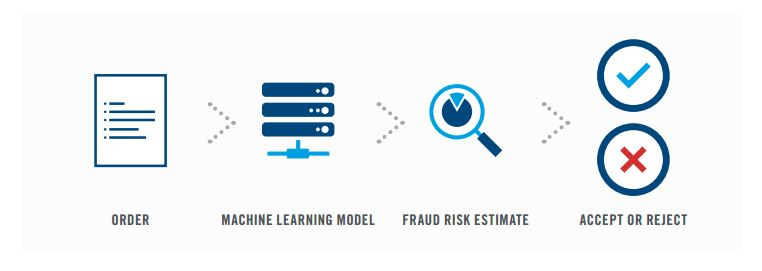

# Table of contents
+ [Background and the Data](#background-and-the-data)
+ [Goal](#goal)
+ [EDA](#EDA)
+ [Building the Model](#Building-the-Model)
+ [Business Case](#Business-Case)
+ [Dashboard](#Dashboard)

### Background and the Data
Fraud in one of the biggest challenges in many company. The losses can be big part of financial responsibility.

Implementing a fraud prevention system not only avoid the chance of catastrophic losses, it also boost the confidence of investors, partners and clients in the organization.

The data contain 600k plus transaction history from a bank similar organization. It include some detail of each transaction, among with table to identify fraud users, users information, currency conversion rate

### Goal

1. Implement a machine learning model to detect if a user is fraud.
2. Implement suggestion action base on the prediction.
3. Base on business case, define the best threshold to deploy the model.

### EDA
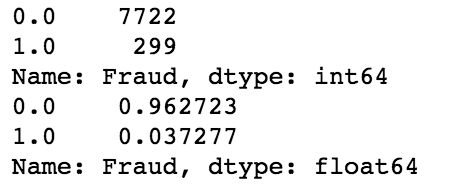
Total of 8021 users.
About 3.7% of users are fraud.

Some of EDA done to the data.
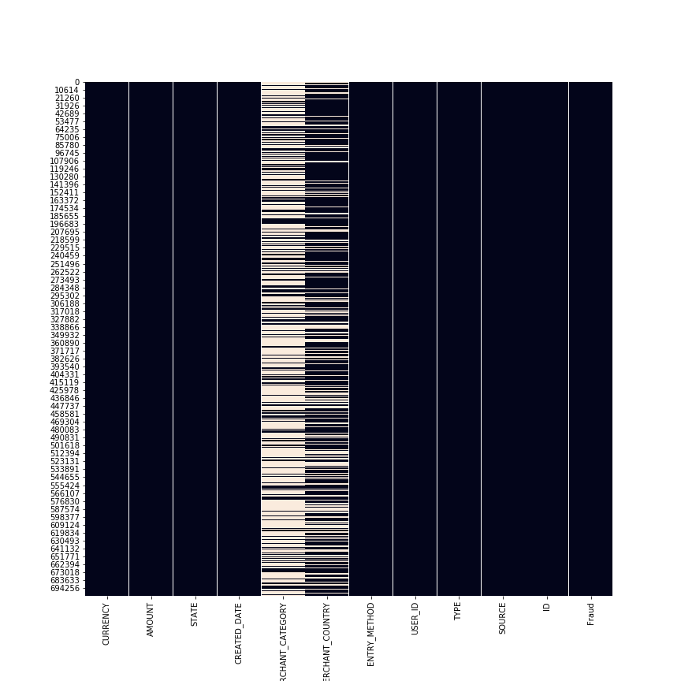
Looking at the missing data heatmap, data is only missing on the merchant_category and merchant_country columns.

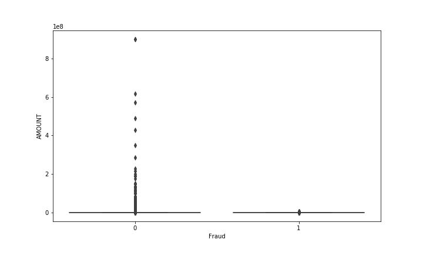
Looking at box plot for the amount of transaction, there are lots of outlier.

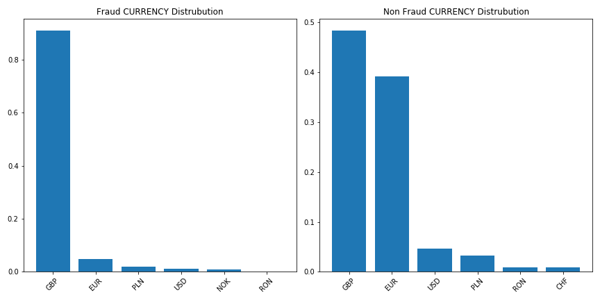
Looking at the currency distribution, Fraudster has over 90% transaction is in GBP, the local currency.

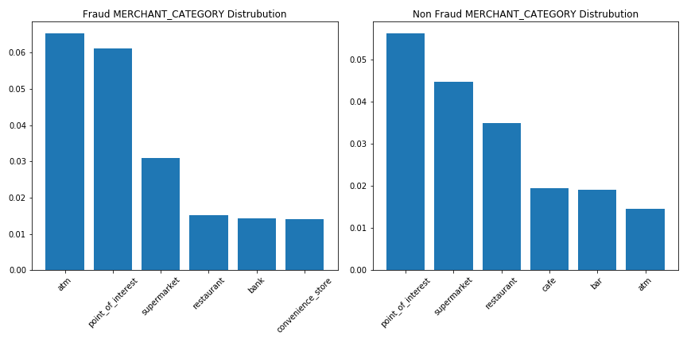
Looking at the merchant category,For Fraudster, atm transaction percentage is more than 4 times as none fraud transaction.

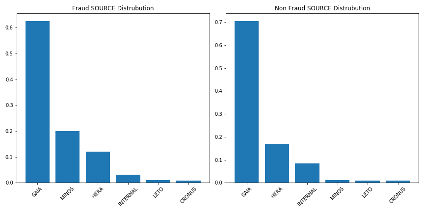
Looking at the source of transaction.For Fraudster, minos percentage is more than 15 times than the none fraud transaction.

For the User data table:

Looking at the account age. Both group, seems to have similar distribution, user that are not fraud had a fatter tail. So on average, the age of account is older for users that are not fraud.

### Building the Model
1 represent Fraud, 0 represent not a fraud. 
Split data into training set and test set.

For a baseline Model. 
If someone is going to randomly guess if is going to be fraud or not.
  The machine learning model should do better than this.
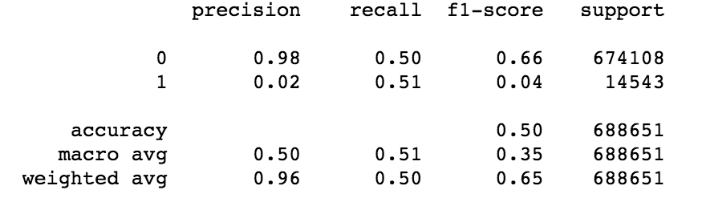

The chance of correctly guess something is fraud going to be 2%.

Build a Random Forest and Gradient Boosting Model base on some features. 
Categorial feature is covert to dummies variables. 
By using features "AMOUNT","TYPE","SOURCE" to build a random forest model and Gradient boosting model:
 
Random Forest:

Gradient Boosting:

In both model, precision go up, but recall is really low.

Feature Engineering: 
Since the model result is not great, feature engineering is perform base on EDA.
9 Feature is created: 
'is_atm': is the transaction category ATM. 
'is_GBR': is the transaction from UK. 
'is_manu': is the entry method manu. 
'is_bank_transfer': is it a bank transfer. 
'is_minos': is the source minos. 
'is_USA': is it from USA. 
'phone': how many country in users profile. 
'is_kyc_none': is user KYC status none. 
'is_4': is the number of country in phone 4. 

Using these new features and group all user id together, get the median value of each user.

Random Forest:

Gradient Boost:

The model perform a lot better, Precision is above 60% and recall is above 40%.

Check the feature importance:
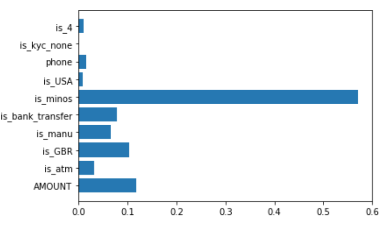

Looks like some of the feature contribution to the model is really low.

Take out these low contribution features to build a new model
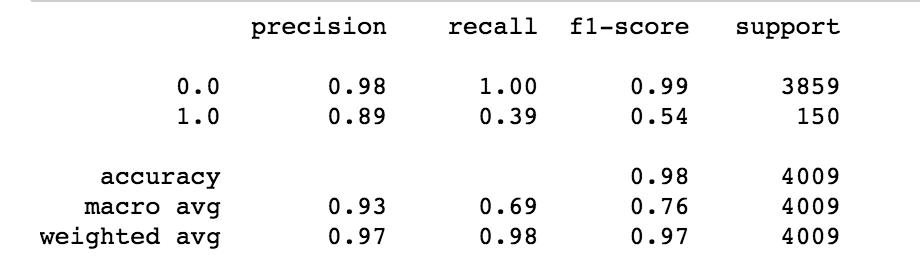

Precision is higher, recall is almost the same.

Build model by using the mean instead of median after groupby on reduce features:
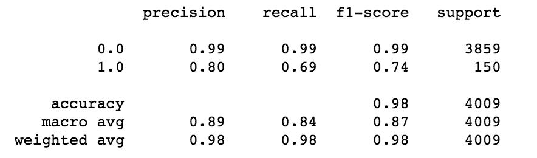

Using the mean, the model is a lot more promising. With precision and recall on fraud to be 80% and 69% on the test set.

That means the model is able to capture 69% of fraudsters and 80% of the time is correct.

Perform Oversampling, undersampling, XGBOOST on the data, the result is not as good as the previous model.

Grid Search: 
parameters = {
    "loss":["deviance"],
    "learning_rate": [0.01, 0.05, 0.1, 0.2],
    "max_depth":[3,5,8],
    "max_features":["log2","sqrt"],
    "criterion": ["friedman_mse",  "mae"],
    "subsample":[0.6,0.7,0.8],
    "n_estimators":[100,500,700,1000]
    }

### Business Case

Looking at the data.

On average, the mean Fraud Transaction Amount is 132, and 62 for not fraud. 

Assumption:  
Assuming loss for Fraud is 132, and 20% of the loss is not recoverable, which is about 26.5
 Revenue from non fraud is 2% of 62, which is 1.24

Every False Positive(Predict Fraud but not Fraud) case, loss is # of FP * 1.24.  
Every False Negative(Predict not Fraud but Fraud), loss is # of FN * 26.5. 
Every True Negative(Predict not Fraud and not Fraud), gain is # of TN * 1.24.
Every True Positive(Predict Fraud and Fraud), gain is 0.

Looking at the ROC curve, the tradeoff between true positive rate and false positive rate can be seen:
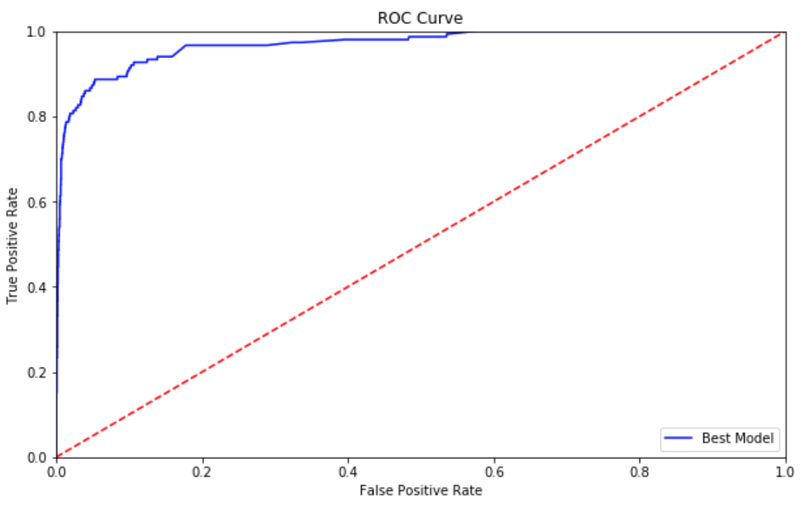

For business, one of the goal is to max revenue, this can be put into the model and decide a threshold.
Graph below show threshold vs revenue:
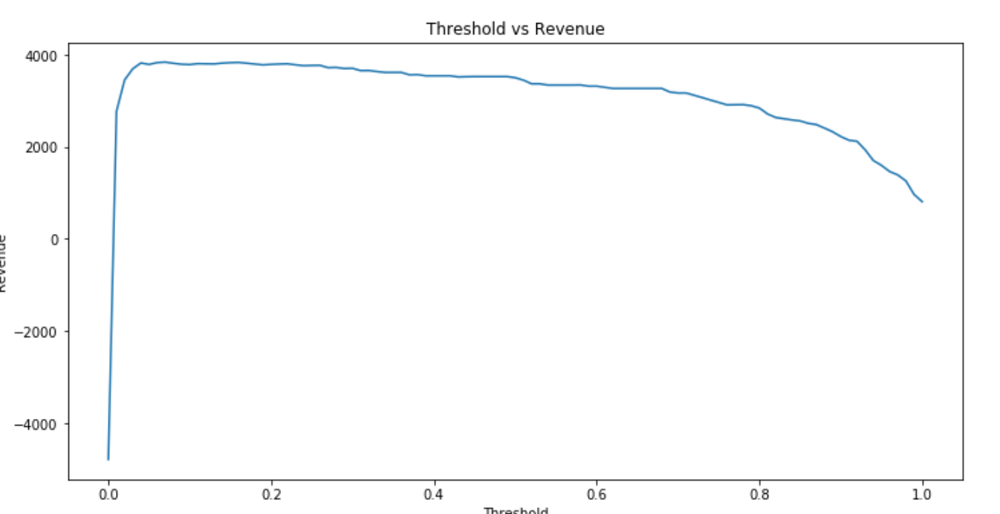

Revenue max when threshold is at 7%, recall is 85% and precision 47%. 
Using 7% threshold on the test dataset, the model will miss 22 fraud, and classify 146 person that is not fraud to be fraud. 
True Positive Rate will be 128/(128+22) = 85.33%  
False Positive Rate will be 146/(146+3713) = 3.78% 
Revenue = -26.5 * 22 - 1.24 * 146+ 1.24 * 3713 = 3840.8

In real life, a lot more factors is consider we decide which threshold is used to deploy the mode. Max revenue one of the baseline decision.

In this example: a threshold of 7% may max the revenue, but 3.5% of innocent users will be classify as fraud as well. Which might be really bad customer experience if those users not able to successfully complete the transaction.

A threshold of 30% will only decrease the revenue by 4% and reduce incorrectly non fraud users to be less than 1%.

### Dashboard

To see how threshold, gain and loss impact the revenue, customers, a dashboard is created to visualize the effects.

Users is able to choose threshold, expect loss per fraud, expect gain per non fraud to determine the best case.

[Link to Threshold Dashboard!]https://public.tableau.com/shared/3S2PDR7P8?:display_count=yes&:origin=viz_share_link)
[Link to Review Dashboard!](https://public.tableau.com/views/FraudReviewDashboard/FraudDectectDashboard2?:embed=y&:display_count=yes&:origin=viz_share_link)
[Link to EDA Dashboard!](https://public.tableau.com/views/EDADashboard_15644203932690/Dashboard1?:embed=y&:display_count=yes&publish=yes&:origin=viz_share_link)
